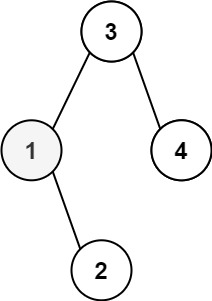
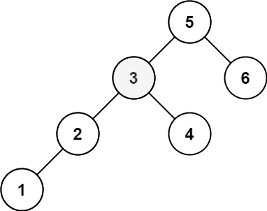

Given the root of a binary search tree, and an integer k, return the kth smallest value (1-indexed) of all the values of the nodes in the tree.

Example 1:

Input: root = [3,1,4,null,2], k = 1

Output: 1

Example 2:

Input: root = [5,3,6,2,4,null,null,1], k = 3
Output: 3

Constraints:

    The number of nodes in the tree is n.
    1 <= k <= n <= 104
    0 <= Node.val <= 104
